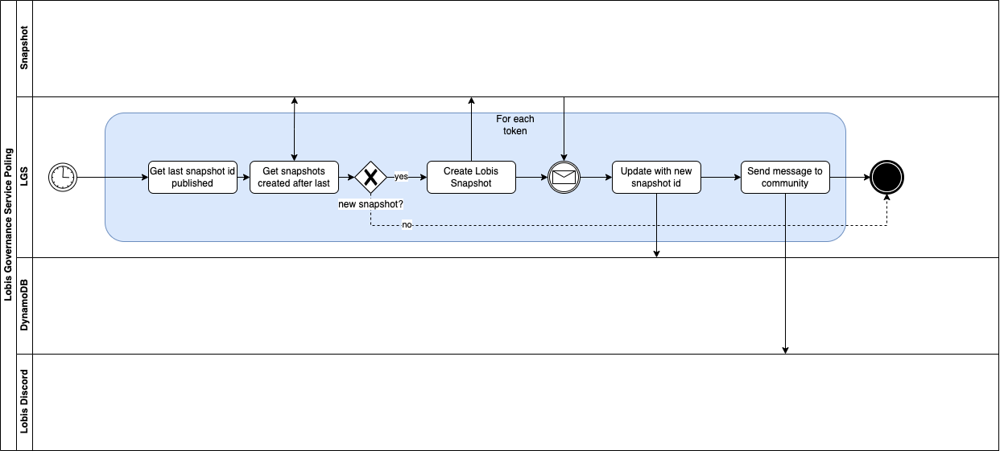
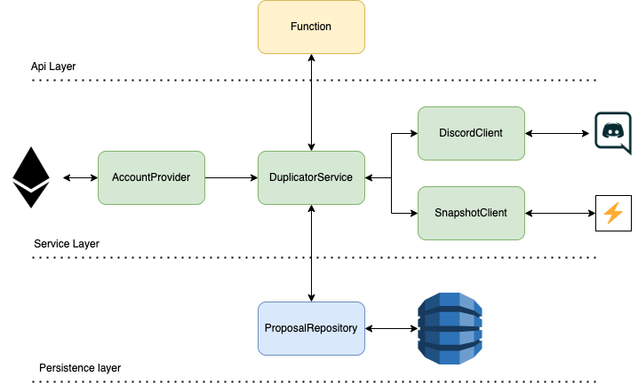
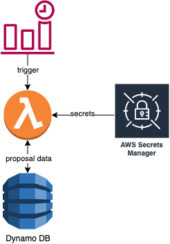

# Snapshot Duplicator

Snapshot duplicator is used, as the name implies to duplicate proposals from one, or more [Snapshot](https://snapshot.org/) spaces to another.  
Its motiveted by a need from LOBIS DAO described in [Google Docs](https://docs.google.com/document/d/e/2PACX-1vQzzObUGNUEh6zSjrUBL856jlma41t0FHyeqKns6_C1a_q9i2JHVHyTfS2w_UeMBqUhklOdZSNjwhkQ/pub)

## Configuration
Snapshot duplicator requires some configuraiton in order to work.

### 1 - Application configuration
The main application configuration is located in [here](./src/configuration/ApplicationConfig.ts).  
Here you can define your snapshot proposal configuration, as well as the sources you intend to duplicate from.  
```ts
export const config: ApplicationConfig = {
  spaces: new Map<string,SpaceConfig>([
    [ /* Frax space configuration */
      'frax.eth', {  /* Space id*/
        name: 'Frax', /* String to identify the space */
        destination: 'fabien.eth', /* Destination space for the duplicate proposal */
        voteClose: 7200, /* In seconds: duplicateEnd = originalEnd - voteClose */
        filter: (data) => true /* Function to filter out any unwanted duplicates, return false to filter out */
      }
    ]
  ]),
  snapshotConfig: {
    space: 'fabien.eth', /* Default desination space for any missconfigured snapshot */
    strategies: [ /* Snapshot voting strategies, check out snapshot docs for more info */
        {
          name: 'erc20-balance-of',
          params: {
            symbol: 'sLOBI',
            address: '0x8ab17e2cd4f894f8641a31f99f673a5762f53c8e',
            decimals: 9
          }
        }
    ],
    network: '1', /* Snapshot network (1 == EthMain), check out snapshot docs for more info on all the possible networks */
    plugins: {}, /* Snapshot plugins, check out snapshot docs for more info */
    metadata: {} /* Snapshot metadata, check out snapshot docs for more info */
  },
  discordChannelId: '912732018465452042' /* Discord channel id to which the bot will send the message */
}
```

### 2 - Secrets
This app uses secrets from AWS secrets manager check out the implementation [here](./src/configuration/SecretsManager.ts).  
It expects the following secrets structure:  

```ts
{
    privateKey: string, /* private key used to sign the created proposals */
    discordToken: string /* discord bot token for authentication */
}
```

## Build and deployment
This project was build using node14 so make sure to set your local node version to 14.  

### Building
`npm install`
`npm run compile`
### AWS deployment
`sam deploy --guided`

## Architecture

### Flow


## Low level architecture


## AWS integration architecture
